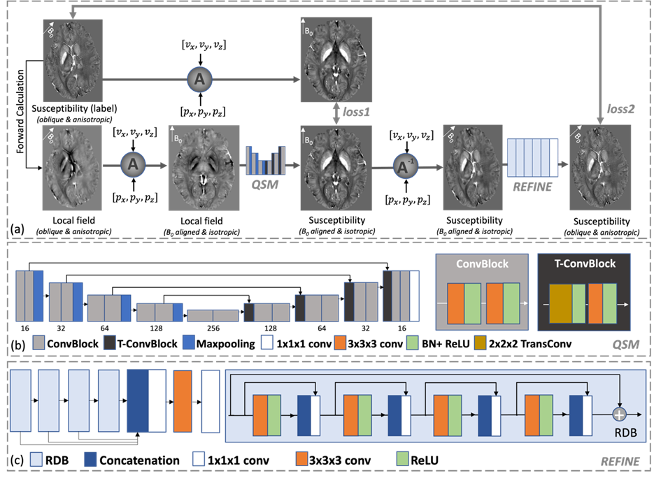

# Affine Transformation Edited and Refined (AFTER) Deep Neural Network for Quantitative Susceptibility Mapping

- This repository contains a dedicated deep neural network for quantitative susceptibility mapping from highly oblique and anisotropic resolution scans up to 0.6 mm.

- This code was built and tested on Window 11. It is recommended to have at least 8GB GPU memory to run the code.

- The paper has been published on Neuroimage: https://www.sciencedirect.com/science/article/pii/S1053811922009636?via%3Dihub.

##  Overall Framework 

Fig. 1:  Overview of the proposed AFTER-QSM training process. 

The AFTER-QSM method incorporates a U-net for conventional 0.6 mm isotropic QSM of pure-axial head orientation reconstruction and a successive refinement network for the correction of the affine transformation.
To register the arbitrary input into the required resolution and head orientation, the affine matrix is computed based on the given voxel size and the B0 direction vector.

To avoid the problem of "out of ROI" due to affine transformation, the padding should be carefully calculated for both training and testing.

## Usage 

- For training, two of the most important arguments are listed:

        python train.py -use_dense False -padding 16

    - use_dense: Boolean value determining dense architecture or Squeeze And Excitation. For the memory efficiency, the dense conncetion can be replaced by Squeeze-and-Excitation at the minimum cost of deblurring peformance.
    - padding: surrounding zero padding in case of rotating over the matix boundary.

Please implement PleaseImplementYourDataset by overriding the function path_composition in train.py

- For testing, a code example given, with data and the reconstructing result in the folders:

    
        python test.py -data_path test_data/hemorrage_anistropic.nii -vox [0.6, 0.6, 2] -z_prjs [0.005. 0.225, 0.974] -segment_num 8

    - data_path: path to the testing data. 
    - vox: voxel size of the testing data.
    - z_prjs: voxel size of the testing data.
    
    - use_GPU: boolean value determining to use GPU or not.
    - GPU_NO: The number of GPU to be used for testing.
    
    - save_path: save path of testing result.
    - checkpoint_path: path of the selected checkpoint.
  
    - segment_num* a compromise for memory occupation for more than 8GB but less than 12GB memory, 8 is preferable for less than 24GB 4 is preferable depending on the matrix size of the testing data.

    - data_type: direct recon if field, forward calculation otherwise.

    * segment_num determines the number of z-dim splitted segments of the whole 3D volume to be processed during refinement. To avoid the boundary effect, reflect padding is chosen for CNN padding.

